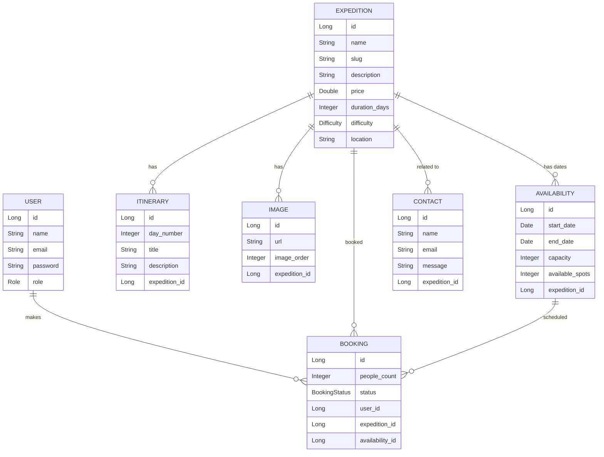

# Herramientas-Seccion-Grupo-06 API — Documentación para Frontend

## Base URL

```
http://localhost:8080
```

## Autenticación JWT

1. **Registrarse** → `POST /auth/register` → obtienes `token`
2. **Iniciar sesión** → `POST /auth/login` → obtienes `token`
3. **Usar el token** en todas las requests que lo requieran:

```
Authorization: Bearer <token>
```

El token expira en **24 horas**.

---

## Endpoints

### Auth (público)

#### `POST /auth/register`

```
Content-Type: application/json
```

**Request:**
```json
{
  "name": "John Doe",
  "email": "john@example.com",
  "password": "password123"
}
```

**Response (201):**
```json
{
  "token": "eyJhbGciOiJIUzI1NiJ9...",
  "email": "john@example.com",
  "name": "John Doe"
}
```

**curl:**
```bash
curl -X POST http://localhost:8080/auth/register \
  -H "Content-Type: application/json" \
  -d '{"name":"John Doe","email":"john@example.com","password":"password123"}'
```

---

#### `POST /auth/login`

```
Content-Type: application/json
```

**Request:**
```json
{
  "email": "john@example.com",
  "password": "password123"
}
```

**Response (200):**
```json
{
  "token": "eyJhbGciOiJIUzI1NiJ9...",
  "email": "john@example.com",
  "name": "John Doe"
}
```

**curl:**
```bash
curl -X POST http://localhost:8080/auth/login \
  -H "Content-Type: application/json" \
  -d '{"email":"john@example.com","password":"password123"}'
```

---

### Expedition (público)

#### `GET /api/expeditions`

Lista todas las expediciones.

**Response (200):**
```json
[
  {
    "id": 1,
    "name": "Camino Inca",
    "slug": "camino-inca",
    "description": "Trek clásico a Machu Picchu",
    "price": 599.99,
    "durationDays": 4,
    "difficulty": "MODERATE",
    "location": "Cusco, Perú",
    "itineraries": [
      { "id": 1, "dayNumber": 1, "title": "Inicio", "description": "Salida desde Cusco" }
    ],
    "images": [
      { "id": 1, "url": "https://...", "imageOrder": 1 }
    ],
    "availabilities": [
      { "id": 1, "startDate": "2026-06-01", "endDate": "2026-06-05", "capacity": 20, "availableSpots": 15 }
    ]
  }
]
```

**curl:**
```bash
curl http://localhost:8080/api/expeditions
```

---

#### `GET /api/expeditions/{id}`

Obtiene una expedición por ID.

**Response (200):**
```json
{
  "id": 1,
  "name": "Camino Inca",
  "slug": "camino-inca",
  "description": "Trek clásico a Machu Picchu",
  "price": 599.99,
  "durationDays": 4,
  "difficulty": "MODERATE",
  "location": "Cusco, Perú",
  "itineraries": [...],
  "images": [...],
  "availabilities": [...]
}
```

**curl:**
```bash
curl http://localhost:8080/api/expeditions/1
```

---

### Expedition Admin (requiere `Bearer <admin_token>`)

#### `POST /api/admin/expeditions`

Crea una nueva expedición.

**Request:**
```json
{
  "name": "Camino Inca",
  "slug": "camino-inca",
  "description": "Trek clásico a Machu Picchu",
  "price": 599.99,
  "durationDays": 4,
  "difficulty": "MODERATE",
  "location": "Cusco, Perú",
  "itineraries": [
    { "dayNumber": 1, "title": "Inicio", "description": "Salida desde Cusco" }
  ],
  "images": [
    { "url": "https://...", "imageOrder": 1 }
  ],
  "availabilities": [
    { "startDate": "2026-06-01", "endDate": "2026-06-05", "capacity": 20 }
  ]
}
```

`difficulty` puede ser: `EASY`, `MODERATE`, `HARD`

**Response (201):** Misma estructura que `GET /api/expeditions/{id}`

**curl:**
```bash
curl -X POST http://localhost:8080/api/admin/expeditions \
  -H "Content-Type: application/json" \
  -H "Authorization: Bearer <token>" \
  -d '{"name":"Camino Inca","slug":"camino-inca","description":"Trek clásico","price":599.99,"durationDays":4,"difficulty":"MODERATE","location":"Cusco"}'
```

---

#### `PUT /api/admin/expeditions/{id}`

Actualiza una expedición existente (mismos campos que create, todos opcionales excepto los obligatorios).

**Response (200):** Expedición actualizada.

**curl:**
```bash
curl -X PUT http://localhost:8080/api/admin/expeditions/1 \
  -H "Content-Type: application/json" \
  -H "Authorization: Bearer <token>" \
  -d '{"name":"Camino Inca Actualizado","slug":"camino-inca","description":"...","price":699.99,"durationDays":5,"difficulty":"HARD","location":"Cusco"}'
```

---

#### `DELETE /api/admin/expeditions/{id}`

**Response (204):** Sin contenido.

**curl:**
```bash
curl -X DELETE http://localhost:8080/api/admin/expeditions/1 \
  -H "Authorization: Bearer <token>"
```

---

### Booking (requiere `Bearer <user_token>`)

#### `POST /api/bookings`

Crea una reserva. Toma la disponibilidad y reduce `availableSpots`.

**Request:**
```json
{
  "availabilityId": 1,
  "peopleCount": 2
}
```

**Response (201):**
```json
{
  "id": 1,
  "peopleCount": 2,
  "status": "CONFIRMED",
  "userId": 1,
  "expeditionId": 1,
  "expeditionName": "Camino Inca",
  "availabilityId": 1,
  "startDate": "2026-06-01",
  "endDate": "2026-06-05"
}
```

`status` puede ser: `PENDING`, `CONFIRMED`, `CANCELLED`

**curl:**
```bash
curl -X POST http://localhost:8080/api/bookings \
  -H "Content-Type: application/json" \
  -H "Authorization: Bearer <token>" \
  -d '{"availabilityId":1,"peopleCount":2}'
```

---

#### `GET /api/bookings`

Lista las reservas del usuario autenticado.

**Response (200):**
```json
[
  {
    "id": 1,
    "peopleCount": 2,
    "status": "CONFIRMED",
    "userId": 1,
    "expeditionId": 1,
    "expeditionName": "Camino Inca",
    "availabilityId": 1,
    "startDate": "2026-06-01",
    "endDate": "2026-06-05"
  }
]
```

**curl:**
```bash
curl http://localhost:8080/api/bookings \
  -H "Authorization: Bearer <token>"
```

---

#### `POST /api/bookings/{id}/cancel`

Cancela una reserva y restaura `availableSpots`.

**Response (204):** Sin contenido.

**curl:**
```bash
curl -X POST http://localhost:8080/api/bookings/1/cancel \
  -H "Authorization: Bearer <token>"
```

---

### Contact (público)

#### `POST /api/contact`

Envía un mensaje de contacto. `expeditionId` es opcional.

**Request:**
```json
{
  "name": "John Doe",
  "email": "john@example.com",
  "message": "Me gustaría más información sobre el tour",
  "expeditionId": 1
}
```

**Response (201):** Sin contenido.

**curl:**
```bash
curl -X POST http://localhost:8080/api/contact \
  -H "Content-Type: application/json" \
  -d '{"name":"John Doe","email":"john@example.com","message":"Info please","expeditionId":1}'
```

---

## Roles

| Rol | Permisos |
|-----|----------|
| `ADMIN` | CRUD expediciones |
| `USER` | CRUD reservas propias, ver expediciones |

Al registrarse el rol asignado siempre es `USER`. Para crear un admin debe hacerse directamente en base de datos.

---

## Modelo de Datos (ERD)



## Enums

| Enum | Valores |
|------|---------|
| `difficulty` | `EASY`, `MODERATE`, `HARD` |
| `status` (booking) | `PENDING`, `CONFIRMED`, `CANCELLED` |
| `role` (user) | `USER`, `ADMIN` |

## Códigos de Error

| Situación | HTTP Status |
|-----------|-------------|
| Validación fallida | 400 Bad Request |
| Email duplicado | 400 Bad Request |
| Slug duplicado | 400 Bad Request |
| No hay suficientes spots | 400 Bad Request |
| Recurso no encontrado | 400 Bad Request |
| No autenticado | 403 Forbidden |
| Rol incorrecto | 403 Forbidden |
